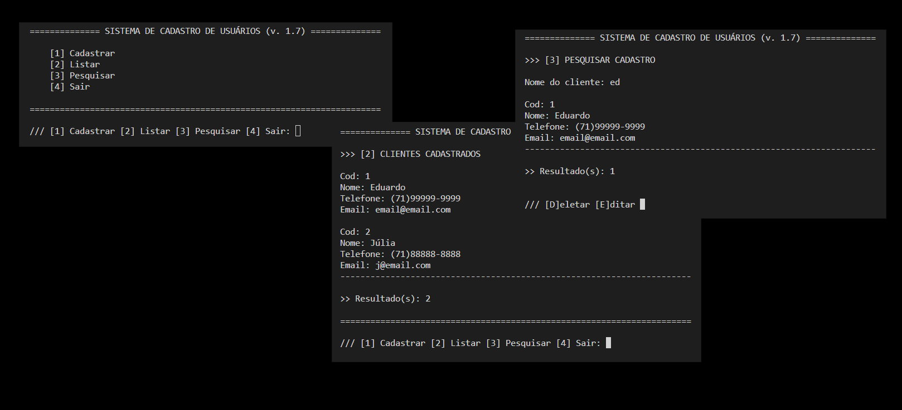

<h1 align="left">Agenda de Contatos</h1>

<h2>Tecnologias</h2>
Esse projeto foi desenvolvido com as seguintes tecnologias:  
<ul>
    <li>Python</li>
    <li>SQLite</li>
</ul>
<h2>Projeto</h2>

Estudo Python: Conceitos de Orientação a objetos, CRUD e Criação de Pacotes. Desenvolvimento de uma Aplicação de Cadastro de Usuários, utiliza SQLite. Roda no terminal. Projeto pessoal (estudo).

